# index.html 技術ドキュメント

## 概要

袖ケ浦フォレストレースウェイのウェブサイトのトップページです。サーキットの紹介、最新ニュース、イベント情報、ライブカメラ映像などを表示します。

## 主な仕様

-   ヒーローセクションでサーキットの魅力を伝える。
-   コース仕様、利用形態、施設設備などの特徴を紹介する。
-   ライブカメラ映像（メインストレート、ヘアピンコーナー）を表示する。
-   最新ニュースをニュルブルクリンクスタイルで表示する。
-   フルスクリーン画像でインパクトを与える。
-   近日開催のイベントを紹介する。
-   SNSへのリンクを表示する。
-   レスポンシブデザインに対応し、モバイルメニューを提供する。

## 更新履歴

-   2024/07/30: 各セクションの画像ファイル名を、内容に合わせて固有の名前に変更。
    -   ヒーローセクション: `hero-background.jpg`
    -   ライブカメラ - メインストレート: `live-camera-main-straight.jpg`
    -   ライブカメラ - ヘアピンコーナー: `live-camera-hairpin.jpg`
    -   ニュース - スーパーGT: `news-super-gt.jpg`
    -   ニュース - ドライビングスクール: `news-driving-school.jpg`
    -   ニュース - メンテナンス: `news-maintenance.jpg`
    -   ニュース - レンタルカート: `news-rental-kart.jpg`
    -   フルスクリーン画像: `fullscreen-background.jpg`
    -   イベント - Track Day: `event-track-day.jpg`
    -   イベント - Racing School: `event-racing-school.jpg`
    -   イベント - Super GT Test: `event-super-gt-test.jpg`

## 構造 (Mermaid)

```mermaid
graph TD
    A[index.html] --> B(ヘッダー);
    A --> C(メインコンテンツ);
    A --> D(フッター);
    A --> E(JavaScript);

    B --> B1(トップバー);
    B --> B2(ナビゲーション);
    B1 --> B1a(天候);
    B1 --> B1b(連絡先);
    B1 --> B1c(言語切替);
    B2 --> B2a(ロゴ);
    B2 --> B2b(ナビ項目);
    B2 --> B2c(モバイルメニューボタン);

    C --> C1(ヒーローセクション);
    C --> C2(フィーチャーセクション);
    C --> C3(ライブカメラ);
    C --> C4(ニュースセクション);
    C --> C5(フルスクリーン画像);
    C --> C6(イベントセクション);
    C --> C7(SNSセクション);

    C1 --> C1a(背景画像: hero-background.jpg);
    C1 --> C1b(コンテンツ);

    C2 --> C2a(コース仕様);
    C2 --> C2b(利用形態);
    C2 --> C2c(施設設備);

    C3 --> C3a(メインストレート画像: live-camera-main-straight.jpg);
    C3 --> C3b(ヘアピン画像: live-camera-hairpin.jpg);

    C4 --> C4a(特集記事: news-super-gt.jpg);
    C4 --> C4b(サブ記事1: news-driving-school.jpg);
    C4 --> C4c(サブ記事2: news-maintenance.jpg);
    C4 --> C4d(サブ記事3: news-rental-kart.jpg);

    C5 --> C5a(背景画像: fullscreen-background.jpg);
    C5 --> C5b(コンテンツ);

    C6 --> C6a(イベント1: event-track-day.jpg);
    C6 --> C6b(イベント2: event-racing-school.jpg);
    C6 --> C6c(イベント3: event-super-gt-test.jpg);

    D --> D1(フッターナビ);
    D --> D2(コピーライト);

    E --> E1(モバイルメニュー制御);
```

## 制限事項

-   ライブカメラの映像は静止画であり、リアルタイム更新機能は実装されていません。
-   天候情報はダミーデータです。
-   言語切り替え機能は現在実装されていません。 